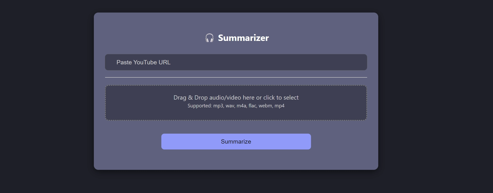

# Ukrainian Content Summarization Pipeline

This project provides an end-to-end pipeline for abstractive summarization of Ukrainian multimedia content based on speech.

The system processes audio and video inputs, performs automatic speech recognition (ASR), and generates concise summaries of the transcribed content.

## Overview

The application supports summarization from:

- YouTube links  
- Audio files  
- Video files  

The pipeline follows a standard cascade approach:

Audio / Video → ASR (speech-to-text) → Text → Summarization

The system is designed to work with noisy, real-world transcriptions and focuses on Ukrainian-language content.

## Features

- Automatic transcription of multimedia content  
- Abstractive summarization of transcribed text  
- Support for long-form content via chunking  
- Modular pipeline design  
- Fine-tuned models for Ukrainian summarization  

## Running the Application

### 1. Clone the repository

```bash
git clone https://github.com/moisamidi/ukr-content-summarization-pipeline.git
cd ukr-content-summarization-pipeline
```

### 2. Create and activate virtual environment

```bash
python -m venv venv
```

Windows:
```bash
venv\Scripts\activate
```

Linux / Mac:
```bash
source venv/bin/activate
```

### 3. Install dependencies

```bash
pip install -r requirements.txt
```

### 4. Run the application

```bash
uvicorn app.main:app --reload
```

### 5. Access the API

After starting the server, the API will be available at the configured host and port.

By default:
http://127.0.0.1:8000

You can open this address in your browser or use an API client (e.g., Postman).

## Example Usage

You can provide:

- a YouTube URL  
- a local audio file  
- a local video file  

The system will return a generated summary of the content.

## Application Interface

Below is an example of the user interface of the application:



## Dataset Creation

The project includes a dedicated module for building custom datasets:

`dataset_creation/`


It consists of two stages:

- transcription (YouTube → text)  
- summarization (text → structured dataset)  

For detailed instructions and configuration, see:

- [Dataset Creation Pipeline](dataset_generation/README.md)

## Experiments

The repository includes an `experiments/` directory containing:

- experiment results  
- scripts used for running experiments  
- artifacts generated during experiments 

The contents may vary depending on the specific experiment and configuration.

All experimental results and artifacts are also collected in a single location for convenience:

- [Full Experiments Archive](https://drive.google.com/drive/folders/1SUb6UjSqrxQhOQ4iX3EHoxa7hTf9PJ87?usp=sharing)

## Models and Datasets

This project includes a series of fine-tuned summarization models and corresponding datasets used throughout the experimental process.

The models were obtained through multiple fine-tuning experiments aimed at identifying the most suitable model for the main pipeline.  
While all versions are provided for completeness, the final pipeline uses **yt-dataset-short-v4-full-prompt2 **, as it demonstrated the best performance (see the Experiments section for details)

### Models (Hugging Face)

- https://huggingface.co/moisamidi/yt-summarizer-v1-short-p1  
- https://huggingface.co/moisamidi/yt-summarizer-v2-short-ft-p2  
- https://huggingface.co/moisamidi/yt-summarizer-v3-short-mixed  
- https://huggingface.co/moisamidi/yt-summarizer-v4-short-full-p2  

---

### Datasets (Hugging Face)

The datasets are provided in two formats:

- **Split datasets** — ready for training (train / validation / test)  
- **Raw / prompt-based datasets** — used during dataset construction and experimentation  

#### Split datasets

- https://huggingface.co/datasets/moisamidi/yt-dataset-short-v1-jsonl-split  
- https://huggingface.co/datasets/moisamidi/yt-dataset-short-v2-jsonl-split  
- https://huggingface.co/datasets/moisamidi/yt-dataset-short-v3-jsonl-split  
- https://huggingface.co/datasets/moisamidi/yt-dataset-short-v4-jsonl-split  

#### Raw / prompt-based datasets

- https://huggingface.co/datasets/moisamidi/yt-dataset-short-v1-prompt1  
- https://huggingface.co/datasets/moisamidi/yt-dataset-short-v2-prompt2  
- https://huggingface.co/datasets/moisamidi/yt-dataset-short-v3-mixed  
- https://huggingface.co/datasets/moisamidi/yt-dataset-short-v4-full-prompt2  
## Notes

- The system is designed for Ukrainian language processing  
- Performance depends on transcription quality  
- The pipeline can be extended with custom models or datasets  
